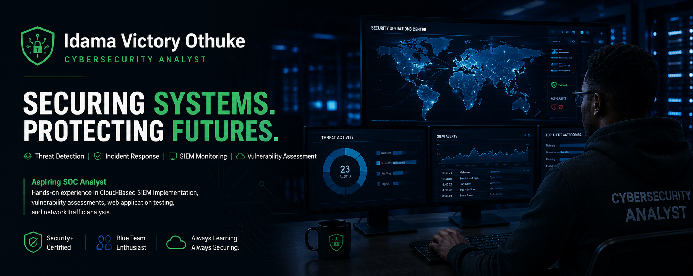

  

# Hi, I'm Idama Victory Othuke 👋

## Cybersecurity Analyst | SOC Enthusiast | Security+ Certified

I am an aspiring SOC Analyst focused on:

- SIEM Monitoring
- Threat Detection
- Incident Response
- Vulnerability Assessment
- Blue Team Operations

# Technical Skills

- Microsoft Sentinel
- Splunk SIEM
- Wireshark
- Nessus
- OWASP ZAP
- Linux
- Network Security
- Endpoint Security
- Log Analysis
- Active Directory
- Problem Solving

# Featured Projects

- Azure Sentinel SIEM Lab
- OWASP ZAP Vulnerability Assessment
- Wireshark Traffic Analysis
- TryHackMe Blue Team Labs
- And more

# Certifications

- CompTIA Security+ SY0-701
- GOMYCODE Intro to Cybersecurity

# 🔥 Featured Projects
---
### ✅ Azure Sentinel SIEM Lab

---
### ✅ AWS IAM User Management and MFA Security Lab

---
### ✅ Windows Event Monitoring with Splunk SIEM

---

### ✅ Vulnerability Assessment Nessus

---
### ✅ OWASP-ZAP-Vulnerability-Assessment-Project

---
### ✅ Vulnerability Assessment Nmap

---
### ✅ Phishing Awareness Lab with Gophish

---
### ✅Active Directory Basics Lab

---
### ✅ Windows Firewall Configuration Lab

---
### ✅SOC Ticketing & Incident Response Workflow

---
### ✅ Phishing-Email-Analysis

---
### ✅ Brute Force Attack Investigation

---
### ✅ EDR Investigation Lab

---
### ✅ TryHackMe Blue Team Labs

 
 
--- 
### ✅ TryHackMe AI Security Labs

  
 
 ---
### ✅ Race Condition Exploitation 

  
 
---
### ✅ Wireshark Traffic Analysis 

  
 

---
# 🔥 Introduction-to-Cybersecurity-Learning-Process @Gomycode

# 📚 Structured Training & Checkpoints

Comprehensive cybersecurity training covering foundational and defensive security concepts.

Detailed module summaries and practical evidence:

---
### ✅ Security Ethics Fundamentals

  

---
### ✅ Network Fundamentals

  

---
### ✅ Active Defense Lab  

 

---
### ✅ Threats Vulnerabilities Architecture

 

---
### ✅ Secure Architecture Design  

 

---
### ✅ Cryptography Secure Implementation 

 

---
### ✅ Security Capstone Project

 

---
# 🎯 Career Objective

Seeking an entry-level SOC Analyst role where I can apply hands-on skills in vulnerability assessment, threat detection, and network analysis while continuously growing in defensive cybersecurity.

## 📬 Contact
- **Email Address:** idamavothuke@gmail.com
- [Linkedin](https://www.linkedin.com/in/idama-victory)
---
## 📌 Note

This repository documents my structured cybersecurity journey, including practical labs, vulnerability assessments, and defensive security exercises.

All testing was performed in controlled lab environments for educational purposes only.
