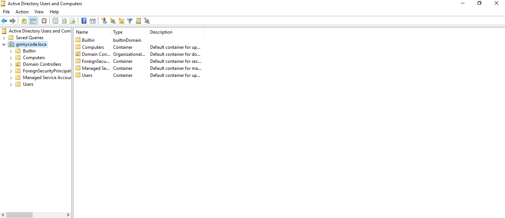
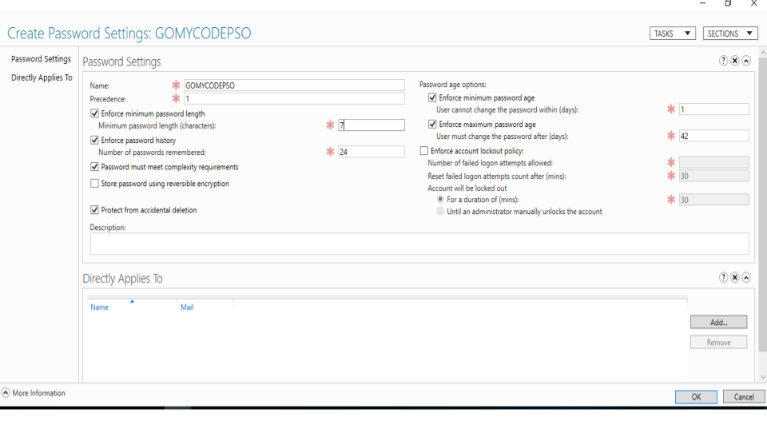

# Module 3: Active Defense

## Objective
To understand active defense techniques and how organizations detect, respond to, and mitigate cyber threats in real time.

## Key Concepts Covered
- Intrusion Detection Systems (IDS)
- Intrusion Prevention Systems (IPS)
- Firewalls and security monitoring
- Log analysis and alerting
- Incident response basics

## What I Learned
- Active defense focuses on detecting and responding to attacks, not just preventing them
- IDS monitors network traffic and alerts on suspicious activity
- IPS can automatically block or stop detected threats
- Logs are essential for identifying security incidents and investigating attacks
- Quick response reduces damage and recovery time

## Real-World Relevance
Active defense is used in Security Operations Centers (SOC) to monitor systems continuously and respond to cyber threats such as malware, brute-force attacks, and network intrusions.

### 📊 Evidence & Documentation

<h1 align="center">Active Directory Configuration</h1>

    

<h1 align="center">Configured User Accounts And Security Groups</h1>

    

<h1 align="center">Password Policy Configuration</h1>

    

<h1 align="center">Group Policy Configuration</h1>

    

<h1 align="center">Active Directory Admimistrative Center</h1>

    

All screenshots and explanations for this module are documented here:

🔗 [Google Slides – Module X](https://docs.google.com/presentation/d/1BNS81NCNovSplIKuFzUSsh9rm93Uns510YfOLbmdMgQ/edit?slide=id.p#slide=id.p)

## Summary
This module helped me understand how cybersecurity teams actively defend systems by monitoring, detecting, and responding to threats using security tools and processes.

  
